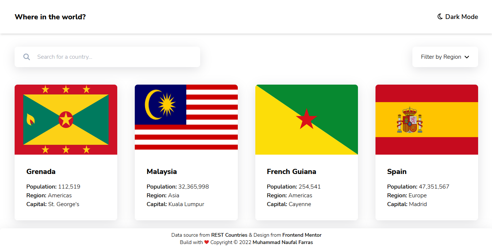
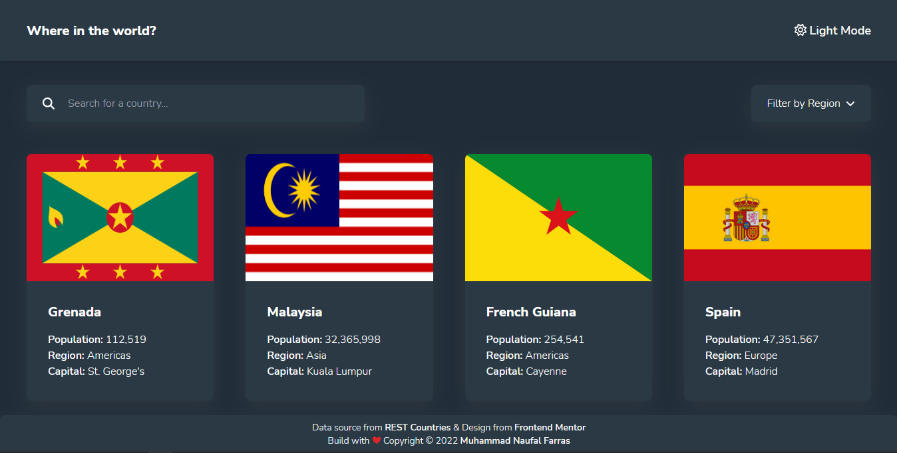

# Frontend Mentor - REST Countries API with color theme switcher solution

This is my solution to the [REST Countries API with color theme switcher challenge on Frontend Mentor](https://www.frontendmentor.io/challenges/rest-countries-api-with-color-theme-switcher-5cacc469fec04111f7b848ca).

## Table of contents

- [Overview](#overview)
  - [The challenge](#the-challenge)
  - [Screenshot](#screenshot)
  - [Links](#links)
  - [Clone](#clone)
- [My process](#my-process)
  - [Built with](#built-with)
- [Author](#author)

## Overview

### The challenge

Users should be able to:

- See all countries from the API on the homepage
- Search for a country using an `input` field
- Filter countries by region
- Click on a country to see more detailed information on a separate page
- Click through to the border countries on the detail page
- Toggle the color scheme between light and dark mode *(this is optional, but I doing it :D)*

### Screenshot

There are two display mode. You can use light mode or dark mode.





### Links

If you want to look the demo of this project, you can [click this link]()

### Clone

If you want to clone this repository, you can use this code:
```git
git clone https://github.com/naufalf25/country-list-app.git
```

## My process

### Built with

- HTML5
- JavaScript
- [TailwindCSS](https://tailwindcss.com/)
- Visual Studio Code

## Author

- Frontend Mentor - [@naufalf25](https://www.frontendmentor.io/profile/naufalf25)
- Instagram - [@naufal_railfans25](https://www.instagram.com/naufal_railfans25/)
- Linkedin - [Muhammad-Naufal-Farras](https://www.linkedin.com/in/muhammad-naufal-farras-2605a2200/)